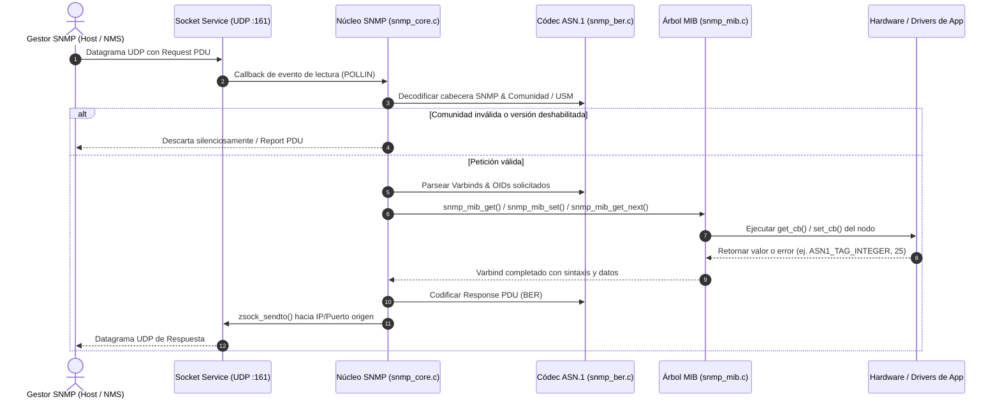

# Arquitectura e Internales del Agente SNMP

Este documento describe la arquitectura interna del subsistema `zephyr-snmp`, sus principios de diseño para sistemas embebidos de recursos limitados, y el ciclo de vida completo de un paquete SNMP.

---

## 1. Principios de Diseño

1. **Cero Asignación Dinámica (`malloc` = 0)**:
   - Toda la memoria de trabajo (estructuras de PDU, buffers de recepción y transmisión, nodos MIB y colas de varbinds) se dimensiona estáticamente en tiempo de compilación mediante Kconfig.
   - Evita la fragmentación del montículo (heap) en microcontroladores con tiempos de ejecución prolongados (semanas o meses continuos).
2. **Concurrencia Segura y Bloqueos Deterministas**:
   - Acceso al árbol MIB protegido mediante mutex del kernel de Zephyr (`k_mutex`).
   - El subsistema de red utiliza el mecanismo `net_socket_service` de Zephyr para polling asíncrono sin desperdiciar un hilo exclusivo por cada socket.
3. **Modularidad Estricta**:
   - Desacoplamiento entre la capa de transporte (UDP sockets), el códec ASN.1 BER, el despachador de operaciones (PDU Handler) y la fuente de datos (MIB Callbacks).

---

## 2. Diagrama de Flujo de Peticiones y Respuestas



---

## 3. Componentes del Núcleo

### A. Capa de Transporte y Servicio de Red (`src/snmp_service.c`)
- Utiliza la macro `NET_SOCKET_SERVICE_SYNC_DEFINE_STATIC` de Zephyr para registrar el descriptor de socket en la infraestructura de sondeo (`zsock_pollfd`) del sistema operativo.
- Da soporte simultáneo a sockets **IPv4** (`AF_INET`) e **IPv6** (`AF_INET6`), vinculando dinámicamente ambos al puerto configurado (`CONFIG_SNMP_AGENT_PORT`, por defecto 161).
- Integra una compuerta de limitación de tasa (*Token Bucket Rate Limiter*) opcional (`CONFIG_SNMP_RATE_LIMIT`) para proteger el procesador contra ataques de denegación de servicio o tormentas de broadcasts.

### B. Códec ASN.1 BER (`src/snmp_ber.c`)
El codificador y decodificador opera directamente sobre buffers de bytes continuos sin intermediarios dinámicos:
- **Etiquetas ASN.1 soportadas**:
  - Primitivas: `INTEGER` (0x02), `OCTET STRING` (0x04), `NULL` (0x05), `OBJECT IDENTIFIER` (0x06).
  - Estructuradas: `SEQUENCE` (0x30).
  - Tipos específicos SNMP: `Counter32` (0x41), `Gauge32` (0x42), `TimeTicks` (0x43), `Counter64` (0x46), `Opaque` (0x44), `IpAddress` (0x40).
  - Tipos PDU: `GetRequest` (0xA0), `GetNextRequest` (0xA1), `GetResponse` (0xA2), `SetRequest` (0xA3), `Trap-v1` (0xA4), `GetBulkRequest` (0xA5), `InformRequest` (0xA6), `SNMPv2-Trap` (0xA7), `Report` (0xA8).
- **Tratamiento de Longitudes BER**:
  - Decodifica longitudes tanto en forma corta (< 128 bytes) como extendida (1 a 4 bytes de longitud).

### C. Motor de Árbol MIB (`src/snmp_mib.c`)
- Almacena los nodos escalares en un arreglo estático `g_mib_nodes` de tamaño `CONFIG_SNMP_MAX_MIB_NODES`.
- Durante el registro (`snmp_mib_register`), los nodos se mantienen ordenados lexicográficamente mediante un ordenamiento por inserción. Esto garantiza que las operaciones **GETNEXT** y **GETBULK** puedan localizar el siguiente objeto válido de manera óptima sin recorrer estructuras complejas de grafos.
- Soporta tablas tabulares (`struct snmp_mib_table`) con múltiples columnas e índices dinámicos.

### D. Motor de Traps y Notificaciones (`src/snmp_trap.c`)
- Mantiene una lista de hasta `CONFIG_SNMP_TRAP_DEST_COUNT` destinos NMS remotos (dirección IP y puerto UDP).
- Permite construir notificaciones con varbinds personalizados o utilizar trampas estándar predefinidas como `snmp_trap_send_coldstart()`.
- Genera el formato de trampa según Kconfig (`CONFIG_SNMP_TRAP_FORMAT_V1` para RFC 1157, `CONFIG_SNMP_TRAP_FORMAT_V2C` para RFC 3416).

---

## 4. Estructuras de Datos Principales

### Definición de un Nodo MIB Escalar
```c
struct snmp_mib_node {
    struct snmp_oid oid;              /* Identificador jerárquico único */
    uint8_t type;                     /* Etiqueta ASN.1 (ASN1_TAG_INTEGER, etc.) */
    snmp_get_cb_t get_cb;             /* Callback invocado en lecturas */
    snmp_set_cb_t set_cb;             /* Callback invocado en escrituras (NULL si es RO) */
    void *user_data;                  /* Puntero libre de contexto */
};
```

### Definición de una Tabla MIB
```c
struct snmp_mib_table {
    struct snmp_oid table_oid;        /* OID del Entry de la tabla */
    uint8_t column_cnt;               /* Número de columnas expuestas */
    const uint8_t *column_subids;     /* Sub-identificadores de columna */
    const uint8_t *column_types;      /* Tipos ASN.1 de cada columna */
    snmp_table_get_cb_t *get_cbs;     /* Array de callbacks de lectura por columna */
    snmp_table_set_cb_t *set_cbs;     /* Array de callbacks de escritura por columna */
    struct snmp_table_row *rows;      /* Lista enlazada estática de filas */
};
```

---

## 5. Parámetros de Memoria y Dimensionamiento en Kconfig

| Parámetro Kconfig | Valor Típico | Impacto en Memoria RAM / BSS |
| :--- | :---: | :--- |
| `CONFIG_SNMP_MAX_PDU_SIZE` | `1024` - `1500` bytes | Tamaño del búfer TX/RX de datagramas UDP. |
| `CONFIG_SNMP_MAX_OID_LEN` | `16` sub-IDs | Profundidad máxima de OID (68 bytes por estructura). |
| `CONFIG_SNMP_MAX_VARBINDS` | `32` | Capacidad máxima de variables agrupadas en un solo paquete. |
| `CONFIG_SNMP_MAX_MIB_NODES` | `128` | Espacio reservado en BSS para nodos escalares. |
| `CONFIG_SNMP_MAX_TABLES` | `8` | Espacio reservado para definiciones de tablas. |
| `CONFIG_SNMP_TRAP_DEST_COUNT` | `3` | Número de servidores NMS receptores simultáneos de trampas. |
