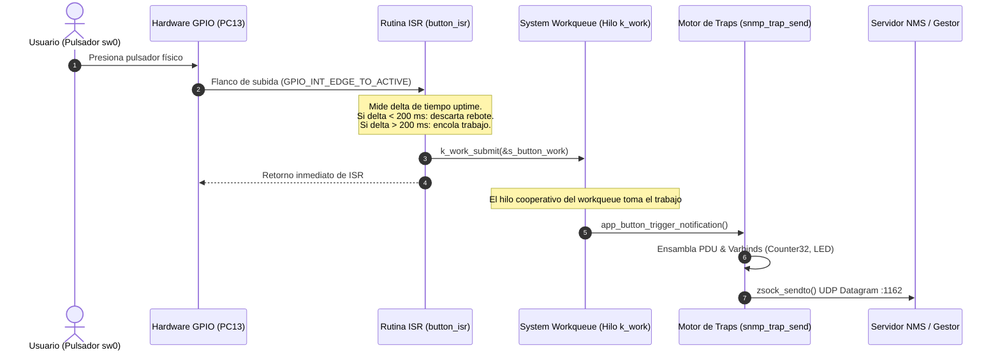
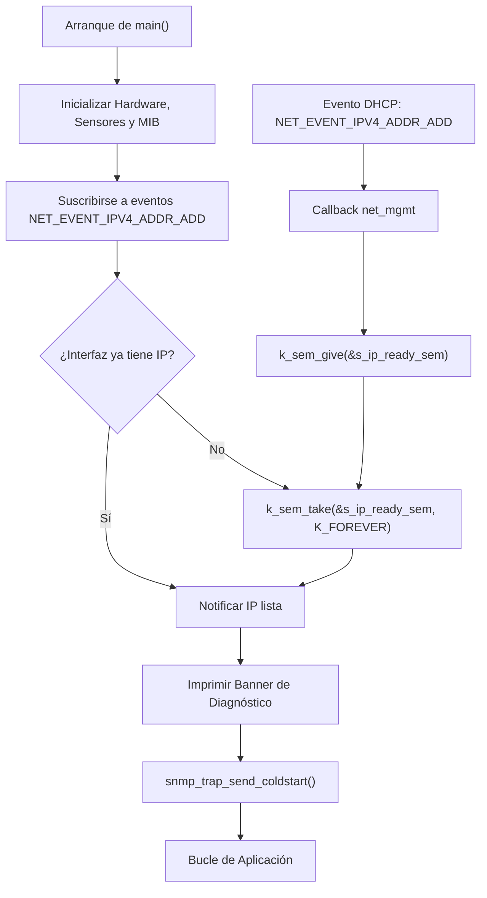

# Integración de Hardware y Pila de Red

Este documento detalla cómo vincular el agente SNMP con el hardware embebido y la pila de red de Zephyr RTOS, implementando buenas prácticas de tiempo real y concurrencia.

---

## 1. Abstracción de Hardware mediante DeviceTree

Zephyr desacopla el hardware mediante DeviceTree (DTS). En placas estándar como la **NUCLEO-H743ZI**, los periféricos de usuario están mapeados mediante alias canónicos:
- `led0`: LED verde de usuario (puerto PB0).
- `sw0`: Pulsador azul de usuario (puerto PC13).

```c
#include <zephyr/drivers/gpio.h>

/* Obtención estática de especificaciones de hardware */
#if DT_NODE_EXISTS(DT_ALIAS(led0))
static const struct gpio_dt_spec s_led = GPIO_DT_SPEC_GET(DT_ALIAS(led0), gpios);
#endif

#if DT_NODE_EXISTS(DT_ALIAS(sw0))
static const struct gpio_dt_spec s_btn = GPIO_DT_SPEC_GET(DT_ALIAS(sw0), gpios);
#endif
```

---

## 2. Control de Actuadores (LED / Relés)

El actuador se configura como salida GPIO y se controla directamente desde los callbacks SNMP `set_cb`:

```c
int app_led_init(void)
{
    if (!gpio_is_ready_dt(&s_led)) {
        return -ENODEV;
    }
    return gpio_pin_configure_dt(&s_led, GPIO_OUTPUT_INACTIVE);
}

void app_led_set_state(int state)
{
    gpio_pin_set_dt(&s_led, state ? 1 : 0);
}

int app_led_get_state(void)
{
    return gpio_pin_get_dt(&s_led);
}
```

---

## 3. Manejo Seguro de Interrupciones y Despacho de Traps

> [!CAUTION]
> **Regla Crítica de Tiempo Real**: **NUNCA** invoque `snmp_trap_send()` ni operaciones de sockets UDP directamente dentro de una rutina de interrupción (ISR). 
> Las operaciones de red requieren asignación de buffers de red (`net_buf`), adquisición de mutexes de socket y posibles bloqueos de contexto que están prohibidos en contexto de interrupción (`in_interrupt()`).

### Patrón Recomendado: ISR + Debounce + Workqueue



### Implementación en Código C (`src/app_button.c`)

```c
static void button_work_handler(struct k_work *work);
static K_WORK_DEFINE(s_button_work, button_work_handler);
static int64_t s_last_press_time = 0;
static uint32_t s_button_counter = 0;

/* 1. Contexto ISR: Rápido y no bloqueante */
static void button_isr(const struct device *dev, struct gpio_callback *cb, uint32_t pins)
{
    ARG_UNUSED(dev); ARG_UNUSED(cb); ARG_UNUSED(pins);

    int64_t now = k_uptime_get();
    /* Filtro de rebote por software (Debounce 200ms) */
    if (now - s_last_press_time > 200) {
        s_last_press_time = now;
        k_work_submit(&s_button_work);
    }
}

/* 2. Contexto Hilo Workqueue: Permite operaciones bloqueantes y sockets */
static void button_work_handler(struct k_work *work)
{
    ARG_UNUSED(work);
    s_button_counter++;

    /* Envío seguro de Trap SNMP con varbinds */
    struct snmp_oid trap_oid = {
        .len = 9,
        .ids = {1, 3, 6, 1, 4, 1, 54321, 1, 2, 1}
    };
    struct snmp_varbind vb[2];
    
    /* Varbind 1: Contador de pulsaciones */
    vb[0].oid.len = 11;
    memcpy(vb[0].oid.ids, (uint32_t[]){1,3,6,1,4,1,54321,1,1,3,0}, 11 * sizeof(uint32_t));
    vb[0].type = SNMP_TAG_COUNTER32;
    vb[0].val.uint_val = s_button_counter;

    /* Varbind 2: Estado del LED */
    vb[1].oid.len = 11;
    memcpy(vb[1].oid.ids, (uint32_t[]){1,3,6,1,4,1,54321,1,1,2,0}, 11 * sizeof(uint32_t));
    vb[1].type = ASN1_TAG_INTEGER;
    vb[1].val.int_val = app_led_get_state();

    snmp_trap_send(&trap_oid, vb, 2, false);
}
```

---

## 4. Gestión de Pila de Red y Sincronización Asíncrona (DHCPv4)

En aplicaciones embebidas conectadas a redes dinámicas, el agente no debe asumir que la dirección IP está disponible inmediatamente al arrancar.

### Sincronización mediante Semáforo



### Configuración Recomendada en `prj.conf`

```ini
# Pila de Red Zephyr
CONFIG_NETWORKING=y
CONFIG_NET_UDP=y
CONFIG_NET_SOCKETS=y
CONFIG_NET_SOCKETS_SERVICE=y
CONFIG_NET_IPV4=y

# DHCPv4 y Fallback a IP estática
CONFIG_NET_DHCPV4=y
CONFIG_NET_CONFIG_SETTINGS=y
CONFIG_NET_CONFIG_NEED_IPV4=y
CONFIG_NET_CONFIG_MY_IPV4_ADDR="192.0.2.1"
CONFIG_NET_CONFIG_MY_IPV4_NETMASK="255.255.255.0"
CONFIG_NET_CONFIG_INIT_TIMEOUT=0

# Dimensionamiento de Stacks (Evita Fatal Error 2 / Stack Overflow)
CONFIG_MAIN_STACK_SIZE=4096
CONFIG_SYSTEM_WORKQUEUE_STACK_SIZE=4096
CONFIG_NET_MGMT_EVENT_STACK_SIZE=2048

# Modo de registro inmediato (evita dereferencias en hilos diferidos)
CONFIG_LOG=y
CONFIG_LOG_MODE_IMMEDIATE=y
```
