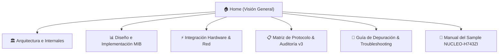

# Zephyr SNMP Wiki

Bienvenido a la documentación oficial y Wiki del subsistema **Zephyr SNMP Agent** (`zephyr-snmp`). Este proyecto proporciona una implementación embebida de agente SNMP (v1, v2c y base v3) diseñada específicamente para **Zephyr RTOS**, caracterizada por:

- **Cero Asignación Dinámica (`malloc` = 0)**: Diseñado para entornos críticos de microcontroladores donde la fragmentación de heap es inaceptable.
- **Integración Nativa con Zephyr**: Utiliza `net_socket_service`, DeviceTree, GPIO APIs, Workqueues y el subsistema de Logging estándar.
- **Soporte de MIB Estándar y Empresarial**: MIB-II (System y SNMP groups) y registro modular de OIDs privados (escalares y tablas).
- **Notificaciones Autónomas**: Despacho de Traps e Informs (v1 y v2c) activados por eventos físicos o de software.
- **Configuración Declarativa**: Control total mediante `Kconfig` y `menuconfig`.

---

## 📚 Mapa de Navegación de la Wiki



1. [**Arquitectura e Internales**](file:///media/jeffry/jqb/GitHub/zephyr-snmp/docs/wiki/Architecture-and-Internals.md)
   - Capas del sistema: Socket Service, Códec ASN.1 BER, Despachador de PDUs y MIB Tree Engine.
   - Modelo de concurrencia y gestión de memoria estática.
   - Motor de Traps y notificaciones asíncronas.

2. [**Diseño e Implementación de MIBs**](file:///media/jeffry/jqb/GitHub/zephyr-snmp/docs/wiki/MIB-Design-and-Implementation.md)
   - Definición de archivos MIB estándar SMIv2.
   - Registro de variables escalares de solo lectura y lectura/escritura (`snmp_mib_register`).
   - Implementación de tablas dinámicas multi-columna (`snmp_mib_register_table`).
   - Validación semántica y control de errores en operaciones SET (`badValue`, `notWritable`).

3. [**Integración de Hardware y Red**](file:///media/jeffry/jqb/GitHub/zephyr-snmp/docs/wiki/Hardware-and-Network-Integration.md)
   - Conexión con DeviceTree (`led0`, `sw0`).
   - Manejo seguro de interrupciones (ISR + Workqueue) para disparo de Traps.
   - Pila de red Zephyr: sincronización DHCPv4, fallback a IP estática y sockets UDP.

4. [**Matriz de Protocolos y Auditoría Técnica**](file:///media/jeffry/jqb/GitHub/zephyr-snmp/docs/wiki/SNMP-Version-Matrix-and-Interoperability.md)
   - Comparativa de capacidades entre SNMPv1, SNMPv2c y SNMPv3.
   - Estado real de interoperabilidad con Net-SNMP, iReasoning MIB Browser y Wireshark.
   - Auditoría técnica honesta de SNMPv3: USM, derivación de claves RFC 3414 vs estado actual.

5. [**Guía de Depuración y Troubleshooting**](file:///media/jeffry/jqb/GitHub/zephyr-snmp/docs/wiki/Troubleshooting-and-Debugging.md)
   - Diagnóstico de problemas de red y timeouts UDP.
   - Análisis de caídas de stack (`net_mgmt_event`) y logs diferidos.
   - Técnicas de captura de paquetes (tcpdump, Wireshark, decodificación BER).

6. [**Sample Completo NUCLEO-H743ZI**](file:///media/jeffry/jqb/GitHub/zephyr-snmp/samples/snmp_agent/README.md)
   - Manual práctico paso a paso de compilación, flasheo, consola interactiva y batería de comandos de prueba sobre hardware real.

---

## ⚡ Inicio Rápido (Quick Start)

### 1. Activar en `prj.conf`

```ini
CONFIG_NETWORKING=y
CONFIG_NET_UDP=y
CONFIG_NET_SOCKETS=y
CONFIG_NET_SOCKETS_SERVICE=y

CONFIG_SNMP_AGENT=y
CONFIG_SNMP_VERSION_1=y
CONFIG_SNMP_VERSION_2C=y
CONFIG_SNMP_TRAP_ENABLED=y
CONFIG_SNMP_AGENT_PORT=161
CONFIG_SNMP_COMMUNITY_READ="public"
CONFIG_SNMP_COMMUNITY_WRITE="private"
```

### 2. Registrar un Escalar en C

```c
#include <snmp/snmp.h>
#include <snmp/snmp_mib.h>

static int32_t s_device_temperature = 25;

static int get_temp(const struct snmp_oid *oid, struct snmp_varbind *vb)
{
    ARG_UNUSED(oid);
    vb->type = ASN1_TAG_INTEGER;
    vb->val.int_val = s_device_temperature;
    return 0;
}

static int set_temp(const struct snmp_oid *oid, const struct snmp_varbind *vb)
{
    ARG_UNUSED(oid);
    if (vb->type != ASN1_TAG_INTEGER) {
        return SNMP_ERR_BAD_VALUE;
    }
    s_device_temperature = vb->val.int_val;
    return 0;
}

void register_my_mibs(void)
{
    static const struct snmp_mib_node temp_node = {
        .oid = {.len = 9, .ids = {1, 3, 6, 1, 4, 1, 54321, 1, 0}},
        .type = ASN1_TAG_INTEGER,
        .get_cb = get_temp,
        .set_cb = set_temp,
    };
    snmp_mib_register(&temp_node);
}
```

### 3. Consultar desde el Administrador (Host)

```bash
# Lectura
snmpget -v2c -c public <TARGET_IP> 1.3.6.1.4.1.54321.1.0

# Escritura
snmpset -v2c -c private <TARGET_IP> 1.3.6.1.4.1.54321.1.0 i 30
```
