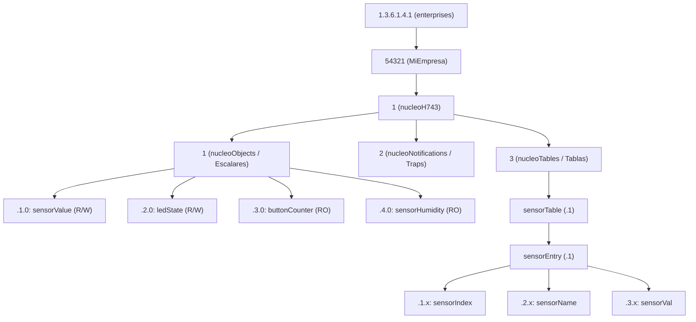

# Diseño e Implementación de MIBs en Zephyr

Este documento es una guía práctica exhaustiva para crear, registrar y mantener variables MIB escalares y tabulares en el agente SNMP de Zephyr RTOS.

---

## 1. Jerarquía y Asignación de OIDs

Toda MIB privada empresarial se ubica bajo el árbol estándar de IANA:
`iso.org.dod.internet.private.enterprises` (`1.3.6.1.4.1.<ENTERPRISE_ID>`).

### Estructura Recomendada de Ramas



> [!IMPORTANT]
> **Convención de Instancia Escalar**: Todo objeto escalar en SNMP **debe** finalizar con el subidentificador `.0` que representa su única instancia. Si se omite el `.0`, las herramientas de gestión devolverán `noSuchInstance`.

---

## 2. Implementación de Variables Escalares

### A. Escalar de Solo Lectura (`Counter32`, `Gauge32`, `OCTET STRING`)

```c
#include <snmp/snmp.h>
#include <snmp/snmp_mib.h>
#include <string.h>

static uint32_t s_packet_count = 1420;
static const char s_model_name[] = "Zephyr-IoT-Gateway-v2";

/* Callback de lectura para Counter32 */
static int get_counter_cb(const struct snmp_oid *oid, struct snmp_varbind *vb)
{
    ARG_UNUSED(oid);
    vb->type = SNMP_TAG_COUNTER32;
    vb->val.uint_val = s_packet_count;
    return 0;
}

/* Callback de lectura para OCTET STRING */
static int get_model_cb(const struct snmp_oid *oid, struct snmp_varbind *vb)
{
    ARG_UNUSED(oid);
    vb->type = ASN1_TAG_OCTET_STRING;
    size_t len = strlen(s_model_name);
    if (len > sizeof(vb->val.octet_str.data)) {
        len = sizeof(vb->val.octet_str.data);
    }
    memcpy(vb->val.octet_str.data, s_model_name, len);
    vb->val.octet_str.len = (uint16_t)len;
    return 0;
}

void register_read_only_scalars(void)
{
    /* 1.3.6.1.4.1.54321.1.1.3.0 */
    static const struct snmp_mib_node node_counter = {
        .oid = {.len = 11, .ids = {1, 3, 6, 1, 4, 1, 54321, 1, 1, 3, 0}},
        .type = SNMP_TAG_COUNTER32,
        .get_cb = get_counter_cb,
        .set_cb = NULL, /* NULL indica explícitamente que es Read-Only */
    };
    snmp_mib_register(&node_counter);

    /* 1.3.6.1.4.1.54321.1.1.5.0 */
    static const struct snmp_mib_node node_model = {
        .oid = {.len = 11, .ids = {1, 3, 6, 1, 4, 1, 54321, 1, 1, 5, 0}},
        .type = ASN1_TAG_OCTET_STRING,
        .get_cb = get_model_cb,
        .set_cb = NULL,
    };
    snmp_mib_register(&node_model);
}
```

### B. Escalar de Lectura y Escritura con Validación de Rango (R/W)

Al implementar operaciones SET, es crucial validar:
1. Que el tipo ASN.1 recibido coincida exactamente con el esperado.
2. Que el valor esté dentro del rango semántico válido.

```c
static int32_t s_fan_speed_percent = 50; /* Rango válido: 0 a 100 */

static int get_fan_speed(const struct snmp_oid *oid, struct snmp_varbind *vb)
{
    ARG_UNUSED(oid);
    vb->type = ASN1_TAG_INTEGER;
    vb->val.int_val = s_fan_speed_percent;
    return 0;
}

static int set_fan_speed(const struct snmp_oid *oid, const struct snmp_varbind *vb)
{
    ARG_UNUSED(oid);

    /* 1. Validación de tipo */
    if (vb->type != ASN1_TAG_INTEGER) {
        return SNMP_ERR_WRONG_TYPE;
    }

    /* 2. Validación de rango semántico */
    if (vb->val.int_val < 0 || vb->val.int_val > 100) {
        return SNMP_ERR_BAD_VALUE;
    }

    /* 3. Aplicar al hardware o estado */
    s_fan_speed_percent = vb->val.int_val;
    return 0;
}

void register_rw_scalar(void)
{
    static const struct snmp_mib_node node_fan = {
        .oid = {.len = 11, .ids = {1, 3, 6, 1, 4, 1, 54321, 1, 1, 7, 0}},
        .type = ASN1_TAG_INTEGER,
        .get_cb = get_fan_speed,
        .set_cb = set_fan_speed,
    };
    snmp_mib_register(&node_fan);
}
```

---

## 3. Implementación de Tablas Multidimensionales

Las tablas SNMP permiten indexar colecciones de objetos homogéneos (por ejemplo, múltiples interfaces de red, canales de sensores o relés de potencia).

### Anatomía OID de una Tabla
- **Table OID**: `.1.3.6.1.4.1.54321.1.3` (`sensorTable`)
- **Entry OID**: `.1.3.6.1.4.1.54321.1.3.1` (`sensorEntry`)
- **Column OID**: `.1.3.6.1.4.1.54321.1.3.1.<COL>` (`1=index`, `2=name`, `3=val`)
- **Instance OID**: `.1.3.6.1.4.1.54321.1.3.1.<COL>.<ROW_INDEX>`

### Código de Registro de una Tabla en Zephyr

```c
/* Estructura de filas estáticas enlazadas */
static struct snmp_table_row s_rows[3] = {
    {.index = 1, .next = &s_rows[1]},
    {.index = 2, .next = &s_rows[2]},
    {.index = 3, .next = NULL}
};

/* Callbacks por columna */
static int col_index_get(const struct snmp_table_row *row, uint8_t col, struct snmp_varbind *vb)
{
    ARG_UNUSED(col);
    vb->type = ASN1_TAG_INTEGER;
    vb->val.int_val = (int32_t)row->index;
    return 0;
}

static int col_name_get(const struct snmp_table_row *row, uint8_t col, struct snmp_varbind *vb)
{
    ARG_UNUSED(col);
    const char *names[] = {"Canal 1 (CPU)", "Canal 2 (Ambiente)", "Canal 3 (Alimentación)"};
    const char *name = (row->index >= 1 && row->index <= 3) ? names[row->index - 1] : "Desconocido";

    vb->type = ASN1_TAG_OCTET_STRING;
    size_t len = strlen(name);
    memcpy(vb->val.octet_str.data, name, len);
    vb->val.octet_str.len = (uint16_t)len;
    return 0;
}

static int col_val_get(const struct snmp_table_row *row, uint8_t col, struct snmp_varbind *vb)
{
    ARG_UNUSED(col);
    int32_t readings[] = {32, 60, 3300};
    vb->type = ASN1_TAG_INTEGER;
    vb->val.int_val = (row->index >= 1 && row->index <= 3) ? readings[row->index - 1] : 0;
    return 0;
}

/* Configuración de la tabla */
static const uint8_t s_col_ids[] = {1, 2, 3};
static const uint8_t s_col_types[] = {ASN1_TAG_INTEGER, ASN1_TAG_OCTET_STRING, ASN1_TAG_INTEGER};
static snmp_table_get_cb_t s_get_cbs[] = {col_index_get, col_name_get, col_val_get};

static struct snmp_mib_table s_my_table = {
    .table_oid = {
        .len = 10,
        .ids = {1, 3, 6, 1, 4, 1, 54321, 1, 3, 1} /* OID de sensorEntry */
    },
    .column_cnt = 3,
    .column_subids = s_col_ids,
    .column_types = s_col_types,
    .get_cbs = s_get_cbs,
    .set_cbs = NULL,
    .rows = &s_rows[0]
};

void register_my_table(void)
{
    snmp_mib_register_table(&s_my_table);
}
```

---

## 4. Definición Formal SMIv2 (`NUCLEO-H743-MIB.txt`)

Para que gestores de red interpreten nombres textuales en lugar de cadenas numéricas de OIDs, se debe proveer el archivo MIB.

Fragmento de definición SMIv2:
```asn1
NUCLEO-H743-MIB DEFINITIONS ::= BEGIN

IMPORTS
    MODULE-IDENTITY, OBJECT-TYPE, NOTIFICATION-TYPE,
    Integer32, Counter32, Gauge32, enterprises
        FROM SNMPv2-SMI
    DisplayString
        FROM SNMPv2-TC;

nucleoH743 MODULE-IDENTITY
    LAST-UPDATED "202609200000Z"
    ORGANIZATION "Zephyr SNMP Community"
    CONTACT-INFO "soporte@example.com"
    DESCRIPTION  "MIB para validacion de SNMP en Zephyr RTOS."
    ::= { enterprises 54321 1 }

-- Definición de ramas
nucleoObjects       OBJECT IDENTIFIER ::= { nucleoH743 1 }
nucleoNotifications OBJECT IDENTIFIER ::= { nucleoH743 2 }
nucleoTables        OBJECT IDENTIFIER ::= { nucleoH743 3 }

-- Objeto Escalar
sensorValue OBJECT-TYPE
    SYNTAX      Integer32 (-40..125)
    MAX-ACCESS  read-write
    STATUS      current
    DESCRIPTION "Temperatura medida en grados Celsius."
    ::= { nucleoObjects 1 }

-- Notificación Trap
buttonPressed NOTIFICATION-TYPE
    OBJECTS     { buttonCounter, ledState }
    STATUS      current
    DESCRIPTION "Trap emitido al presionar el pulsador de usuario."
    ::= { nucleoNotifications 1 }

END
```

---

## 5. Validación en Host con Net-SNMP

Cargar la MIB mediante el flag `-m`:
```bash
# Lectura con nombres simbólicos
snmpget -v2c -c public -m ./NUCLEO-H743-MIB.txt 192.168.16.100 sensorValue.0

# Lectura de la tabla completa formateada
snmptable -v2c -c public -m ./NUCLEO-H743-MIB.txt 192.168.16.100 sensorTable
```
